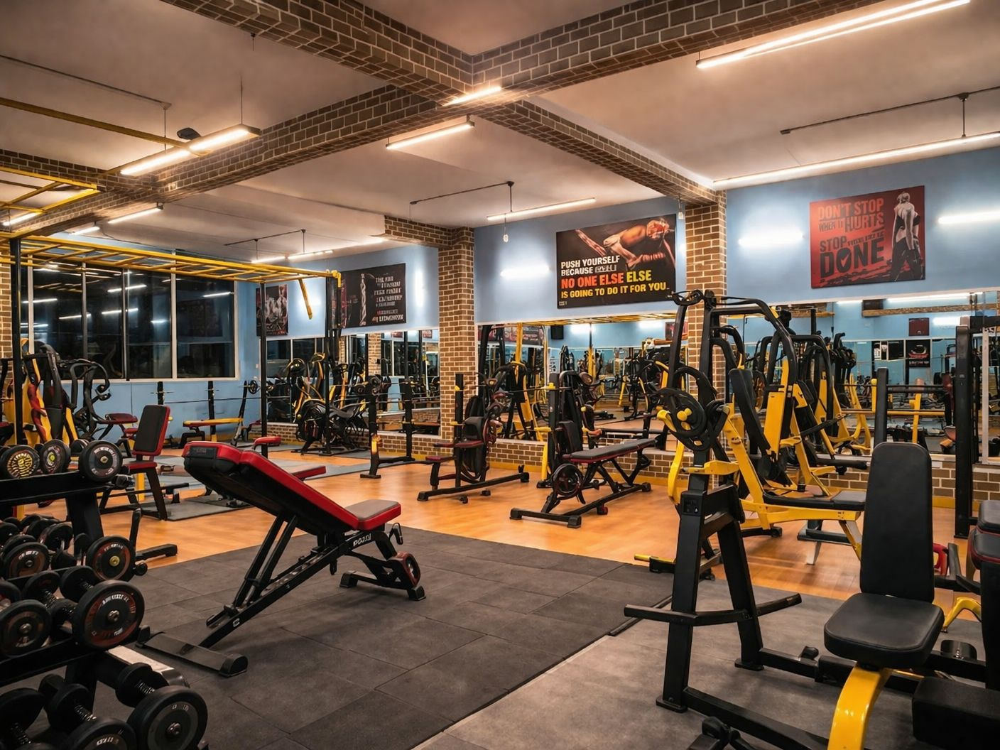
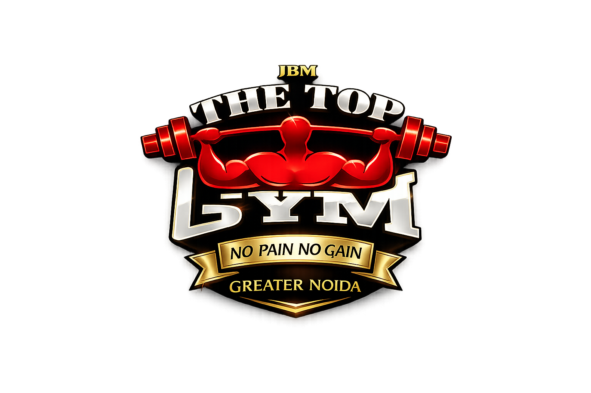

<div align="center">
  <h1>🏋️‍♂️ The Top Gym</h1>
  <p><b>A premium, highly interactive, and lightning-fast fitness center website built with Next.js 14 and React.</b></p>
</div>

---

## 🌟 Overview

The Top Gym is a state-of-the-art landing page and digital presence framework designed specifically for premium fitness centers. Moving away from standard static HTML templates, this application is fully componentized in Next.js—delivering 0-millisecond page transitions, rich native DOM scroll synchronizations, and an incredibly scalable configuration system.

Every word, image, phone number, and class schedule can be instantly updated by editing a single central `content.js` configuration file without ever needing to touch the layout architecture.

## 🚀 Features

- **Buttery-Smooth Navigation:** Custom-engineered viewport observers cleanly bypass React re-render looping to deliver perfect 60fps locking on scroll interactions.
- **Interactive UI Tracker:** The gym's branded logo acts as a dynamic scrollbar, physically traveling up and down the viewport tracking indicator in real-time as you scroll.
- **Premium Aesthetics:** Employs ultra-modern luxury styling including `.backdrop-filter` glassmorphism, sleek dark-mode backgrounds, subtle red pulsing gradients, and 3D card levitation effects.
- **Dynamic Content Architecture:** A fully modular `src/config/content.js` file allows non-developers to edit website copy, classes, pricing, and trainer bios in seconds.
- **Mobile-First Responsive Grid:** Custom CSS grid breakpoints that intelligently consolidate long horizontal lists into stacked, side-by-side grids to preserve vertical space on smartphones.

## 📸 Screenshots

> **Note to Developer:** Add screenshots of the website into the `public/images/` folder and update the filenames below to display them on GitHub!

| Hero Section | Interactive Classes |
| :---: | :---: |
|  |  |

| Pricing Tiers | Mobile Responsive Footer |
| :---: | :---: |
|  |  |

## 💻 Tech Stack

- **Framework:** [Next.js 14](https://nextjs.org/) (App Directory)
- **Library:** [React](https://reactjs.org/)
- **Styling:** Pure Vanilla CSS (Lightweight structure with 0 CSS-in-JS overhead)
- **Deployment:** Optimized for instant [Vercel](https://vercel.com/) one-click deployments.

## ⚙️ How to Update Website Content

You do not need to hunt through dozens of files to update text or prices. Simply open the configuration dictionary located at:
👉 `src/config/content.js`

Here you can easily modify:
- `hero:` Main titles, taglines, and statistics counters.
- `trainers:` Trainer bios, headshots, credentials, and class schedules.
- `pricing:` Subscription names, monthly prices, and enabled/disabled features.
- `global:` Phone numbers, WhatsApp URLs, and physical map locations.

---

## 🛠️ Quick Start (Local Development)

To run this application locally, run the following commands in your terminal:

```bash
# Clone the repository
git clone https://github.com/yourusername/the-top-gym.git

# Navigate into the directory
cd the-top-gym

# Install necessary dependencies
npm install

# Start the local development server
npm run dev
```

Open [http://localhost:3000](http://localhost:3000) in your browser to view the application rendering locally.
